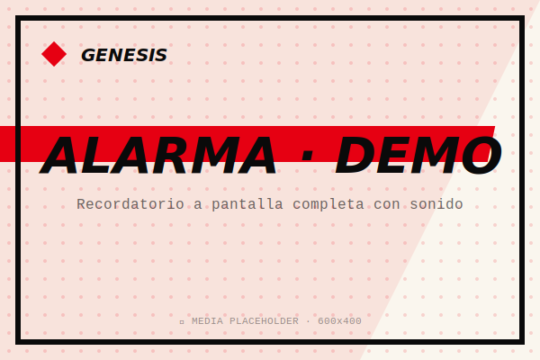
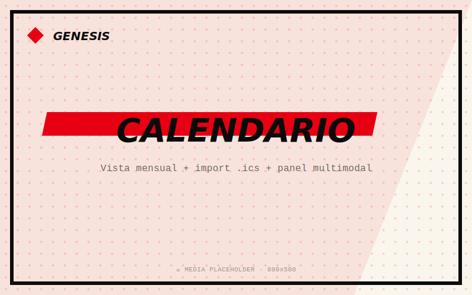
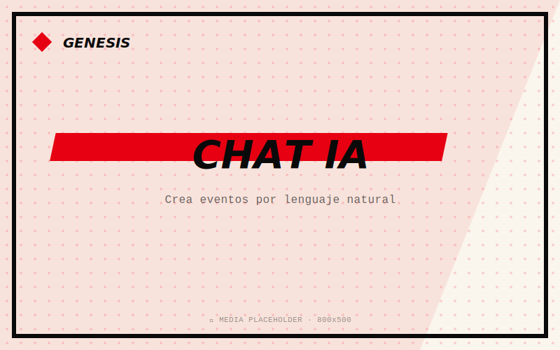

<div align="center">


# Genesis Assistant

**Tu asistente personal de escritorio. Recordatorios, calendario y chat con IA — todo en un binario.**

[](https://github.com/GlennsDms/Genesis-Assistant/releases)
[](LICENSE)
[](#descarga)
[](#cómo-funciona)

[**Descargar (Windows)**](https://github.com/GlennsDms/Genesis-Assistant/releases/latest) · [**Web**](https://glennsdms.github.io/Genesis-Assistant/) · [English README](README.en.md)

</div>

---

## Qué es esto

Genesis es una app de escritorio que combina lo que casi todo el mundo gestiona desde tres sitios distintos — un calendario, una lista de recordatorios y un chat con IA — en una sola ventana que vive en tu PC.

La idea de fondo es sencilla: hacer la gestión personal fácil **sin pedirte una suscripción ni mandar tus datos a un servidor ajeno**. Los recordatorios y eventos viven en una base de datos SQLite local. El chat se conecta a la API gratuita de Google Gemini con tu propia API key, así que no hay intermediario entre tú y el modelo: ni yo paso de las llamadas, ni tu uso depende de que yo mantenga un servidor encendido.

No pretende competir con Notion o con Google Calendar. Es un proyecto open source pensado para ser pequeño, comprensible y funcionar bien en lo que hace.

## Demo

> *Los GIFs y capturas reales irán aquí en breve. Por ahora son placeholders.*

<div align="center">



*Recordatorio activándose: notificación nativa + alarma a pantalla completa con sonido.*

<br />



*Vista calendario mensual con import .ics y panel multimodal.*

<br />



*Chat con IA capaz de crear eventos por lenguaje natural.*

</div>

## Descarga

<table>
  <tr>
    <td align="center" width="33%">
      <strong>Windows</strong><br />
      <em>10 / 11 · 64-bit</em><br /><br />
      <a href="https://github.com/GlennsDms/Genesis-Assistant/releases/latest">⬇ Descargar .exe</a>
    </td>
    <td align="center" width="33%">
      <strong>macOS</strong><br />
      <em>12+ · ARM/Intel</em><br /><br />
      <em>Próximamente</em>
    </td>
    <td align="center" width="33%">
      <strong>Linux</strong><br />
      <em>AppImage / deb / rpm</em><br /><br />
      <em>Próximamente</em>
    </td>
  </tr>
</table>

> **Nota sobre el aviso de SmartScreen.** El instalador no está firmado con un certificado comercial (cuestan 100-400€ al año, no viable para un proyecto open source). Windows mostrará un aviso la primera vez: pulsa *"Más información"* → *"Ejecutar de todos modos"*. Es seguro: el código que se ejecuta es exactamente el que está en este repositorio, puedes auditarlo.

## Cómo funciona

Genesis está construido con **Tauri 2** (que sirve un frontend web desde un backend nativo en Rust). El frontend es **React 18 + TypeScript** sin librerías de UI — todo el CSS está escrito a mano para mantener el bundle pequeño y la estética coherente. La persistencia es **SQLite** vía `tauri-plugin-sql`, con migraciones versionadas. Las notificaciones son nativas del sistema operativo, no toasts en la ventana.

El chat con IA usa **Gemini 2.5 Flash** vía la API oficial de Google. La API key se guarda en la propia base de datos del usuario (`app_settings`), nunca abandona el PC. El modelo soporta *function calling*, lo que permite que la IA cree eventos directamente desde una conversación natural: *"añade reunión con Ana el lunes a las 10"* termina como un evento real en tu calendario.

Algunas decisiones técnicas con su porqué:

- **Tauri en vez de Electron.** Un instalador de Electron pesa 80-120 MB. Tauri produce ejecutables de 5-15 MB porque usa el motor web del SO en lugar de empaquetar Chromium entero. La app arranca más rápida y consume menos RAM.
- **SQLite en vez de localStorage.** localStorage es texto plano sin esquema, fácil de corromper y sin migraciones. SQLite con migraciones versionadas permite evolucionar el modelo de datos entre versiones sin perder los datos del usuario.
- **Sin librería de UI.** Tailwind, MUI o shadcn habrían acelerado las primeras semanas pero impuesto una estética genérica. CSS plano deja libre el diseño y mantiene el bundle alrededor de los 200 KB.
- **BYOK (Bring Your Own Key) para la IA.** En lugar de pagar yo las llamadas a Gemini (insostenible) o suscripciones (rozamiento alto), el usuario aporta su API key gratuita. Es la única forma honesta de ofrecer IA real sin coste recurrente y sin que sus mensajes pasen por servidores intermediarios.

## Probarlo en local

Si quieres compilarlo tú mismo o contribuir, necesitas **Node.js 20+** y **Rust** (`rustup` lo instala). Luego:

```bash
git clone https://github.com/GlennsDms/Genesis-Assistant.git
cd Genesis-Assistant/app
npm install
npx tauri dev
```

La primera compilación de Rust tarda 5-15 minutos. Las siguientes son rápidas.

Para generar un instalador de release:

```bash
npx tauri build
```

El binario aparecerá en `src-tauri/target/release/bundle/nsis/`.

## Lo que hay y lo que no

**Hoy funciona:**

- Recordatorios con notificación nativa y alarma a pantalla completa.
- Calendario mensual con import de archivos `.ics` (Google Calendar, Outlook, Apple Calendar exportan en este formato).
- Chat con IA capaz de crear eventos por lenguaje natural.
- Persistencia local con SQLite y migraciones versionadas.
- Bandeja del sistema con la app viva en segundo plano.

**En el horno (próximos hitos):**

- Builds automáticas multiplataforma con GitHub Actions (macOS, Linux).
- Vistas semanal y de lista para el calendario.
- Cifrado real de la API key con Stronghold (hoy se guarda en texto plano en SQLite — funciona pero es deuda técnica documentada).

**Lo que probablemente no llegue:**

- Sincronización con Google Calendar/Outlook vía OAuth. Es mucha complejidad para un proyecto personal, y rompería la propiedad "tus datos en tu PC". Por ahora se compensa con el import de `.ics`.
- Aplicación móvil. Tauri 2 lo soporta pero no es el caso de uso para el que Genesis fue diseñado.

## Licencia

[MIT](LICENSE). Puedes usarlo, modificarlo y redistribuirlo libremente.

## Agradecimientos

A [Tauri](https://tauri.app/) por hacer que escribir apps de escritorio nativas con la web sea por fin viable. A los equipos de [React](https://react.dev/) y [Vite](https://vite.dev/) por la base. A Google por mantener un tier gratuito en serio en Gemini.

Y a la cafeína. Sobre todo a la cafeína.
